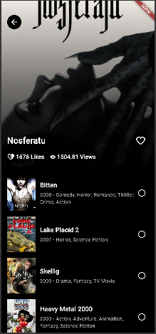

# Movie App Flutter

#### Catálogo de Filmes


#### Detalhes do Filme



Um aplicativo Flutter para explorar filmes populares, ver detalhes de filmes e descobrir filmes similares. O aplicativo utiliza a API do [The Movie Database (TMDb)](https://www.themoviedb.org/) para buscar informações sobre filmes.

---

## **Funcionalidades**

- **Catálogo de Filmes Populares**: Exibe uma lista de filmes populares.
- **Detalhes do Filme**: Mostra informações detalhadas sobre um filme, como título, popularidade e lista de filmes similares.
- **Like/Deslike**: Permite ao usuário curtir ou descurtir um filme.

---

## **Tecnologias Utilizadas**

- **Flutter**: Framework para desenvolvimento de aplicativos multiplataforma.
- **Dio**: Pacote para fazer requisições HTTP à API do TMDb.
- **Bloc/Cubit**: Gerenciamento de estado no Flutter.
- **Clean Architecture**: Organização do código em camadas (data, domain, presentation).
- **Mocktail**: Para criar mocks em testes unitários.
- **Equatable**: Para simplificar a comparação de objetos em testes.

---

## **Pré-requisitos**

Antes de começar, certifique-se de ter o seguinte instalado:

- **Flutter SDK**: [Instalação do Flutter](https://flutter.dev/docs/get-started/install)
- **Dart SDK**: Vem junto com o Flutter.
- **Android Studio/VSCode**: Para desenvolvimento e execução do projeto.
- **API Key do TMDb**: Crie uma conta no [TMDb](https://www.themoviedb.org/) e obtenha uma chave de API.

---

## **Configuração do Projeto**

1. **Clone o repositório**:
   ```bash
   git clone https://github.com/seu-usuario/app_flutter.git
   cd movie_app_flutter

2. **Instale as dependências**:
     ```bash
     flutter pub get

3. **Execute o aplicativo com o comando**:
     ```bash
     flutter run
     
    
